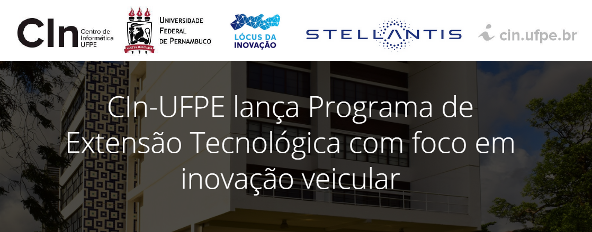

<h1 align="center">
  
</h1>

<h1 align="center">Technological Extension Course: Dependency Data Analysis Applied to Automotive Software </h1>

## Project description

The new extension project of the Centro de Informática (CIn) at UFPE is entitled “Analysis of Dependency Data Applied to Automotive Software”. The training in the area of Software Engineering will be coordinated by the CIn professor Henrique Rebêlo and will emphasize the development/maintenance of software in C/C++ in Automotive applications related to the automotive manufacturer Stellantis. The project's objective is to contribute to the improvement of the process, evolution, and modular maintenance of the dependencies between the features of the automotive systems.

Funded by the Pernambuco Foundation for Science and Technology (FACEPE), the Technological Extension Program (PET) will be carried out in a joint partnership with LocusAutomotivoPE, a state government initiative coordinated by CIn professor Abel Guilhermino, and Stellantis. This initiative aims to develop an innovative environment for scientific and technological development in the automotive sector for the state of Pernambuco.

### 🛠 Technologies

The following tools were used in the construction of the project:

- [C](https://docs.microsoft.com/pt-br/cpp/c-language/?view=msvc-160)
- [C++](https://docs.microsoft.com/pt-br/cpp/cpp/?view=msvc-160)
